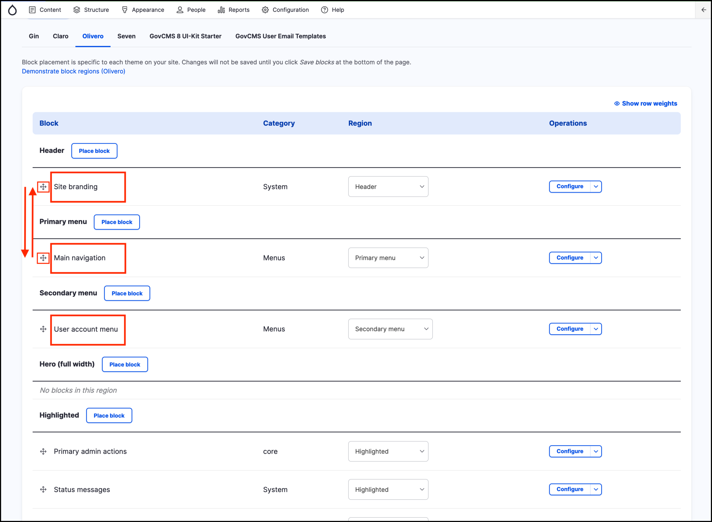

# Blocks in GovCMS

_Blocks_ are pieces of your site’s web page layout. They are placed inside the _regions_ of your theme, and can be created, removed, and rearranged in the _Block layout_ \(_admin/structure/block_\) administration page. Examples of blocks include the _Who’s online_ listing, the main navigation menu, and the breadcrumb trail. The main page content is also a block.

Some modules make new blocks available for placement on your site. For example, when the core **Search module** is installed and configured, it provides a block that contains a search form. You may also create and place your own custom blocks.

Each block has its own configuration settings, which allow you to select which pages of your site will display the block. It’s even possible to place multiple copies of a block, each with its own separate configuration and visibility rules.

## Block administration review

On the _Admin menu_ hover over _Structure_ then click on **Block layout**.

The block admin page shows you the blocks on your site and where they’re displayed. In the default GovCMS \(Olivero\) theme, the main navigation, user account menu and site branding blocks are spread across various regions.

You can change the order of the blocks displaying by using the four-way arrow icons and dragging and dropping the blocks up or down. Once you’re happy with the position, scroll to the bottom of the page and click the **Save blocks** button.

## Disabled blocks

Depending on what modules you have installed, various new blocks become available for activation in any of the site regions. You may explore available blocks by clicking the “Place block” button in the desired region:
