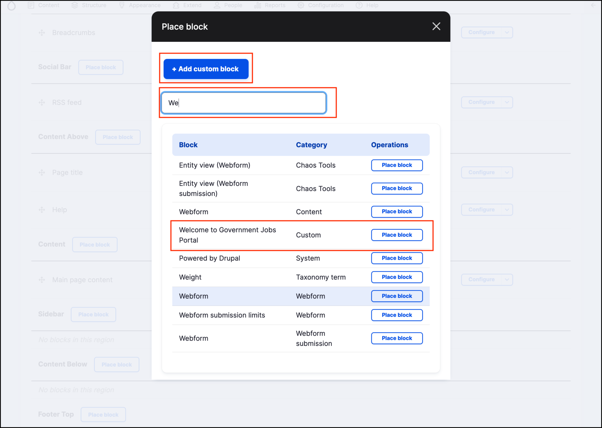

# Exercise 1.3: Place Welcome message block

Many websites contain a welcome message on the homepage. In this exercise you’ll learn how to place a block of content into a page and manage block visibility settings. You will also learn how blocks are placed into page regions.

The screenshot below displays some blocks being placed in various footer regions. You will build a similar block in this exercise.

<figure><figcaption>
Showing Blocks in the various footer regions
</figcaption></figure>

## Add a custom block

1. Navigate to _Structure_ → _Block layout_ → **Add custom block** (/block/add).
2. Select "_Basic text with Image_". Note, the options you see here will depend on the theme that your site is using and will most likely differ on your agency website.
3. Fill out the form:
   * **Block description**: “Welcome to Government Jobs Portal”.
   * **Body**: “Government Jobs Portal is the official site to search and apply for jobs in the federal or state government. Be part of the bigger picture.”
4. Click the **Save** button.

<figure><figcaption>
Entering data into the block creation page
</figcaption></figure>

## Place custom block

Navigate to _Structure_ → **Block layout** and locate the "**Footer top 1**" region. Click the Place block button next to the **Footer top 1** region name.

Locate the block you created, by searching for its name “Welcome to Government Jobs Portal”.

## Assign block to region

Next, you’ll need to assign the block to an area on the site.

1. Scroll down to the **Region** select element. Select **Footer Top**.
2. Finally, configure the block’s **Visibility settings** so the Welcome Message block only appears on the homepage.
3. Under the **Pages** section of the visibility settings.
   * Select the **Show for the listed pages** radio button.
   * Following the screenshot below, enter the text _\<front>_ in the Pages field. This will make sure the block is only displayed on the front (home) page of your site. Leave the other settings as-is.
4. **Save** the block.

After the page is saved, you’ll be redirected to the _Block Layout_ page. If you have multiple blocks assigned to the same region (such as Footer top 1), these can be rearranged on that page. Press the _Save blocks_ button.

Now go to the homepage of your site and view your new welcome message/block in the footer.\

<figure><figcaption>
New block being seeing in the Footer top 1 region
</figcaption></figure>


**Tip:** Blocks aren’t content so they won’t be displayed in the content listing. To view all custom blocks go to _Structure_ → _Block layout_ → **Custom block library** .

