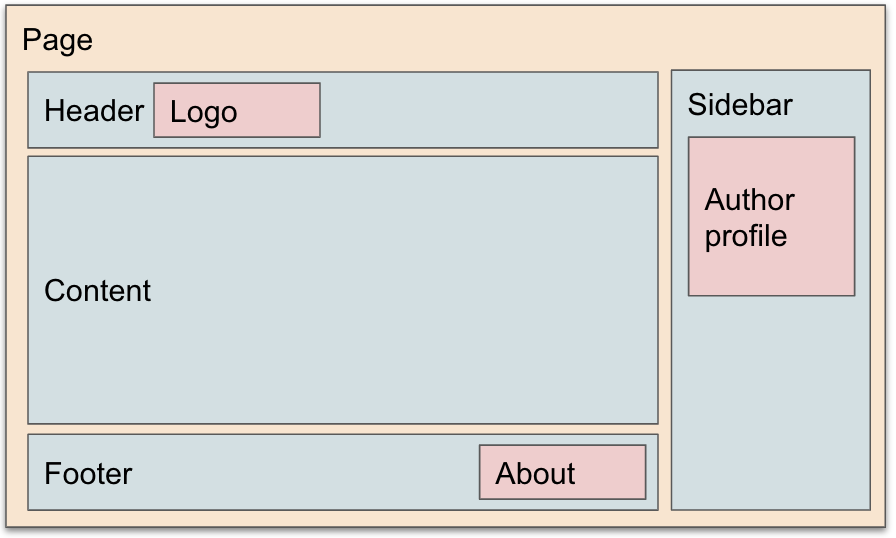

# Layout of a GovCMS page

## Pages, Regions and Blocks overview

**Pages** in GovCMS hold **Regions**. Regions are defined in the theme (in code, in an [info.yaml](https://github.com/govCMS/GovCMS/blob/2.x-develop/govcms.info.yml) file) and cannot be altered via the GovCMS administration backend.

The content is placed into Regions as **Blocks**. Some blocks are created by Content Editors, they are called **content blocks**. Other blocks are created by **modules** or **Views** and provide predefined content listings from the site (e.g. listing of events or publications) or from other systems (e.g. a Twitter block shows Tweets).

The screenshot below shows a page divided up into basic regions of Header, Content, Footer and RHS Sidebar.

\[//]: # ""

The screenshot below represents content blocks placed within regions. The Logo is in the Header region and an Author Profile is in the RHS Sidebar.

You may explore the default theme GitHub repository to review the available regions: https://github.com/govCMS/govcms8\_uikit\_starter/blob/8.x-1.x/govcms8\_uikit\_starter.info.yml#L8

## Theme in GovCMS

A **theme** is a set of files that define the visual look and feel of your site. The core software and modules that run on your site determine which _content_ (including HTML text and other data stored in the database, uploaded images, and any other asset files) is displayed on the pages of your site. The theme determines the HTML markup and CSS styling that wraps the content.

The default theme shipped with GovCMS 9 are:

* [Olivero](https://git.drupalcode.org/project/drupal/-/tree/9.5.x/core/themes/olivero) - (frontend theme)
* [Claro](https://git.drupalcode.org/project/drupal/-/tree/9.5.x/core/themes/claro) - (admin theme)
* [Gin](https://git.drupalcode.org/project/gin) - (admin theme)

The theme defines what regions are available in your GovCMS site.
