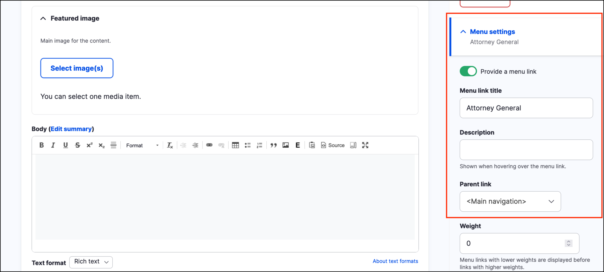
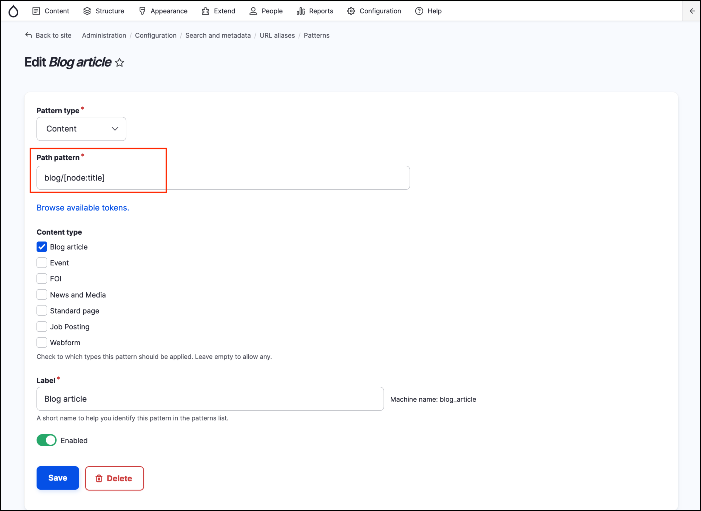

# URL Aliases

Site visitors like to access content from friendly and easy-to-remember URLs. Before we look at URLs in more detail, it’s important to understand GovCMS site structure. Your instructor will show you how GovCMS sites are assembled based on conditions you set.

When adding content to your site, GovCMS automatically assigns a URL alias\*. A URL alias uses the following format “/sanitised-item-title”. This may be useful for many generic purposes, but you could customise the paths.


&#x20;When a new content type is created, the URL pattern has to be configured in order to get the automatic URL aliases to generate.


The _Path_ module adds a _URL ALIAS_ fieldset to the content creation (and editing) form so that you can set up URL aliases for your pages. This provides two main advantages:

* Search engines give better rankings to user-friendly URLs so it’s a good SEO strategy.
* The URLs look better and are more intuitive for the user.

Refer to the following documentation for more information [https://www.drupal.org/docs/user\_guide/en/content-paths.html](https://www.drupal.org/docs/user\_guide/en/content-paths.html)

## Let GovCMS handle URL aliases

Each new content item has a permanent URL that uses numbers, such as **node/1**. You’ll see this URL in the address bar when you click the Edit tab. This link does not change, even if you change the content's _Title_.

When you add content, you can create a custom URL alias and override the default settings.

If you use the content's menu settings to add this to the Main menu, the link will be updated automatically:

## URL Patterns and the Pathauto Module

In GovCMS, we can include a specific URL pattern for our content pages, perhaps based on content type.

Examples:

* **Blog articles:** blog/\[node:title]
* **Events:** events/\[node:title]

