# Exercise 8.4: Agency logo in Job Posting view

In this exercise, we’ll add in the logo of the agency offering the job, by setting up a **View relationship**. In the current setup, the agency’s logo is part of the **Agency content type**, and the view of _Job Posting_ doesn’t allow us to show it. If we link the two content types together, we can display the agency logo in the job posting \(like the screenshot below\).

## Preparation - create Agencies, update Job Postings

1. Add some new Agency content types, and upload a logo for each. See the screenshot below for an example.

    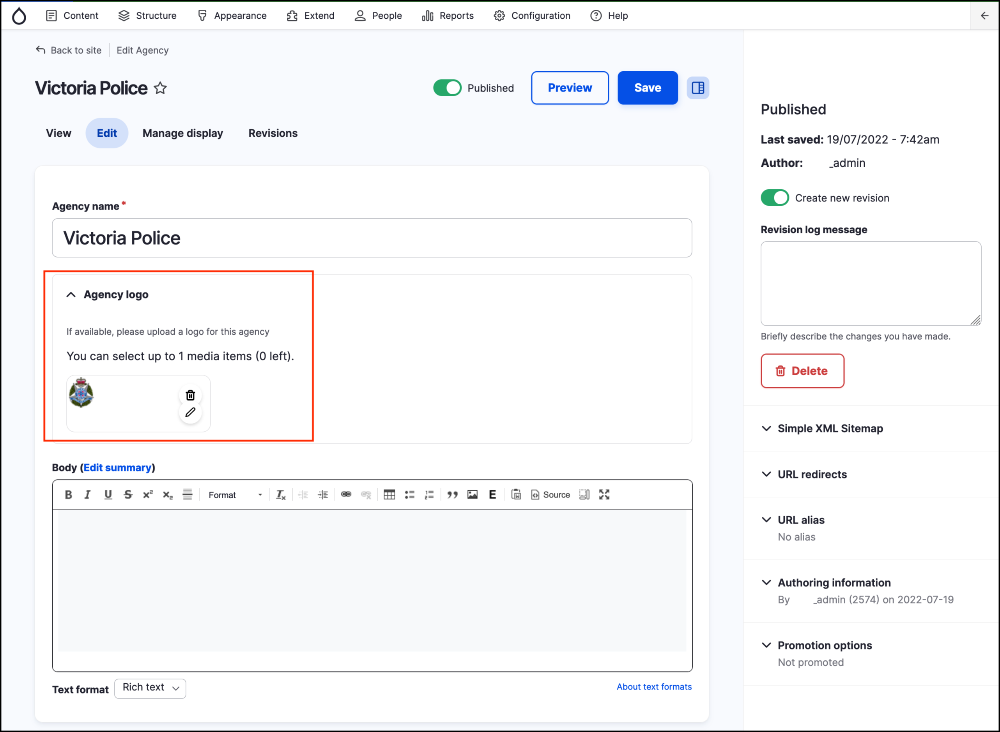

2. Update some existing **Job postings** to link to the agencies setup in step 1. See the screenshot below for an example.

    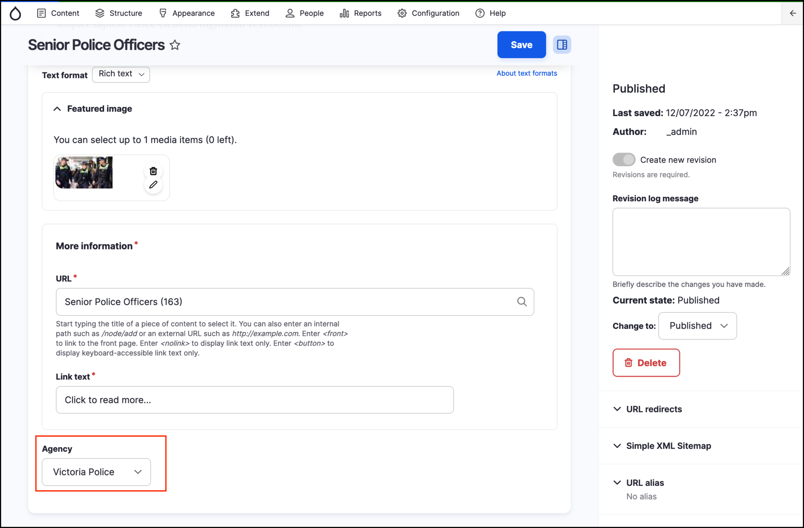

## Logo display in Job posting page

1. Edit the view, change the format:
   1. From the **Job posting** view, click the _Contextual Links_ to "Edit view". 

       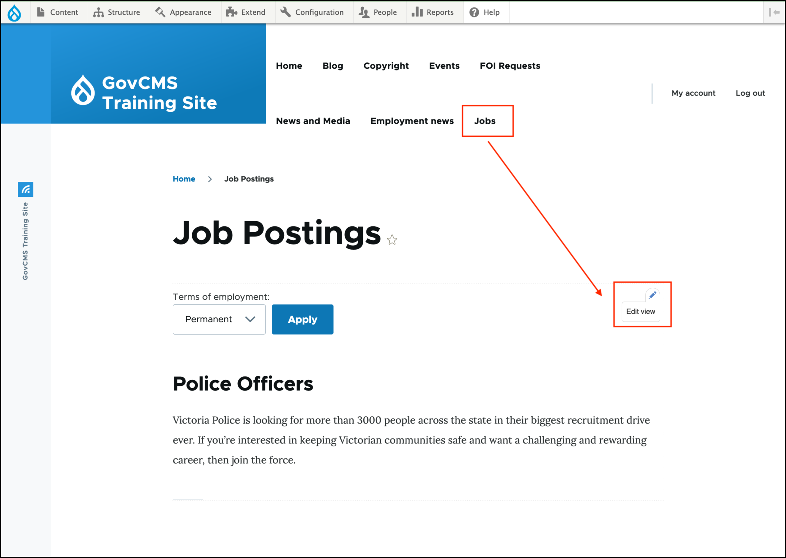
       
   2. Under **Show: Content** click the **Content** link and change the format from **Content** to **Fields.** Click **Apply**. You’ll now get a listing of only fields - scroll down and check the preview.
   3. Make sure you have some agency logos in the sample agency content.

   
Using Teaser _view mode_ in our View helped us avoid crafting our display and allowed us to apply a ready-to-use view mode. As we’ve now switched to use Fields, we need to add all the fields that we need displayed. To make our Job posting similar to the previous display, let’s add a **short summary** of the **Job description** field and a **Read more** link.

1. Under Fields pane, click **Add**.
2. Search for “job description” to filter the list of options. This will display the **Body** field \(remember, we renamed its label to **Job Description** earlier\):

    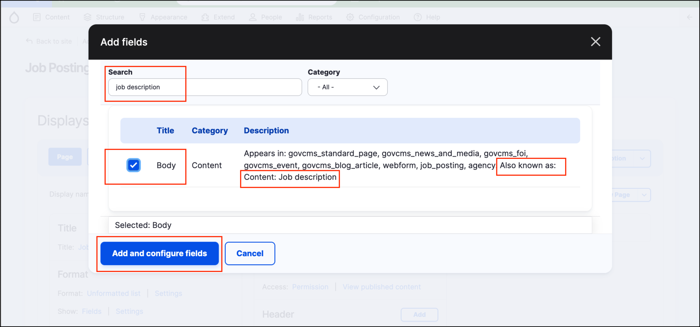
    
3. Click **Add and configure fields**.
4. Select under **Formatter**: **Trimmed**. Leave the limit as-is - 600 characters and click **Apply**.

    

5. Review the **Preview** pane at the bottom of the page.
6. To create a **Read more** link to the content, under **Fields** pane, click **Add**. In the **Add field** popup dialogue, locate the **ID** field and add it to the view.
7. Expand the **Rewrite results** pane \(in the next page\) and select the “Output this field as a custom link” checkbox. 

    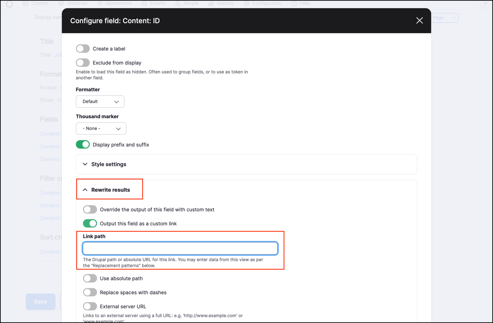
    
9. Add /node/{{ nid }} as the **Link path**.

    
    
10. Apply the changes and preview the result below: 

    
    
## Change ID link to Read more link
    
We’ve now got the link to the content, but it has a numeric node ID as the link text instead of “Read more”. Let’s fix that.
    
1. Click the **Content: ID** link to return to the field editing interface.

    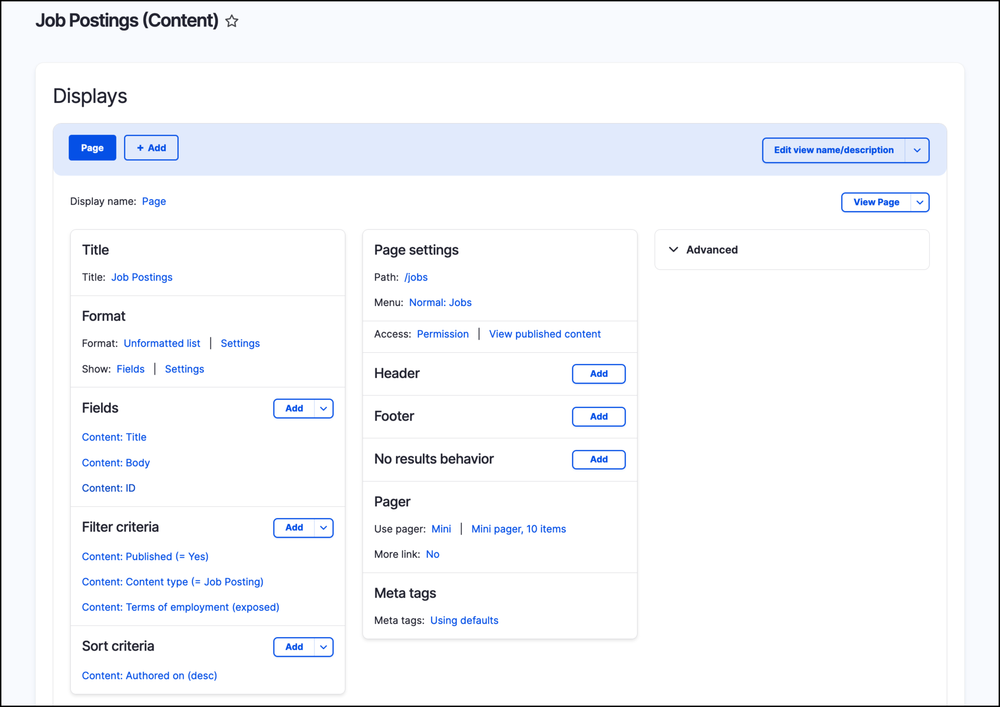
    
2. Locate and expand the **Rewrite Results** pane.
3. Select the **Override the output of this field with custom text** checkbox.
4. In the **Text** area, type: Read more &\#10145; 

    

5. Apply your changes and preview it at the bottom of the page.

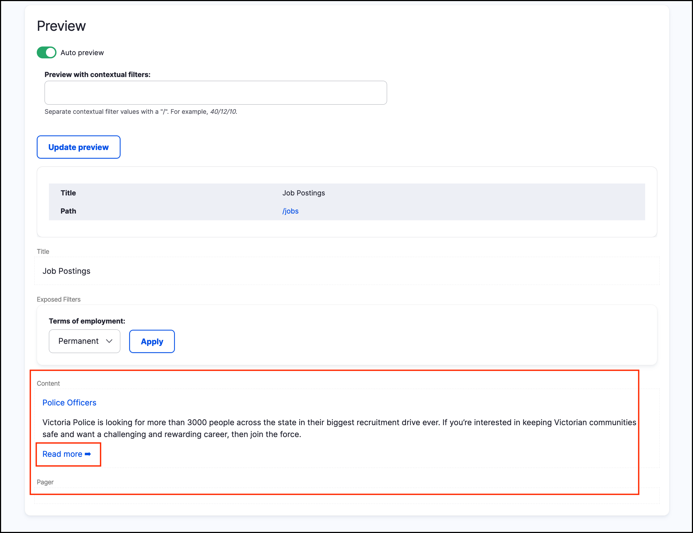

## Add a relationship

Next, we need to add a relationship so that we can join the data from the Agency content type \(specifically the logo\) into the Job posting content type. Without the relationship set up, if you tried to add a new field of “agency logo” to the **Job posting** _content type_ the results would be blank.

1. Click on **Advanced** in the right column. Under "Relationships" click **Add**.
2. Next, search for "agency". 

    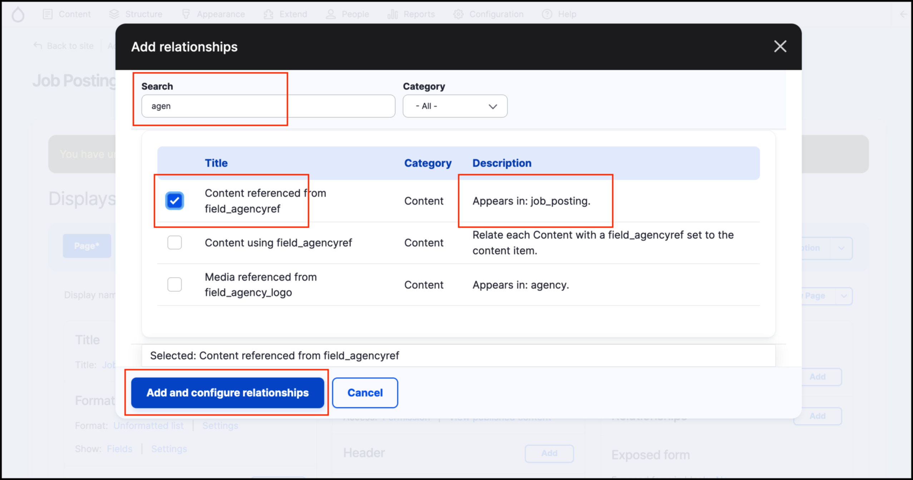
    
3. Select **Content referenced from field\_agencyref**
4. Click **Add and configure relationships**. This will take you to the next configuration screen.
5. Accept the default values and click the **Apply** button.

## Add fields

With the relationship setup, you can now add the fields in the Job Listing content type.

> **Important!** Remember to set the **Relationship** to reference the relationship created in the precedinng steps.

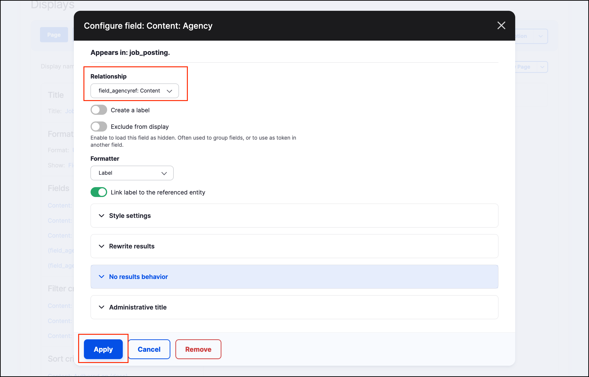

## Review

Scroll down to the Preview section and check that **Agency name** link and **Logo** are displayed.

> **Tip** Change the **Terms of Employment** Filter in the **Preview** pane to see more Job postings.
 
## Rearrange fields

1. Adjust the position of the Agency logo and place it below the **Content: Title** field, by clicking the **Rearrange** link in the **Fields** section 

    
    
2. **Save** your View and review how the display changed.

## Adjust format and output

If you check the Jobs page now, you’ll see that it shows the information we expected it to, but issues with the layout of each job listing make it hard to browse. We could fix the display using CSS, but let’s fix it without modifying any CSS.

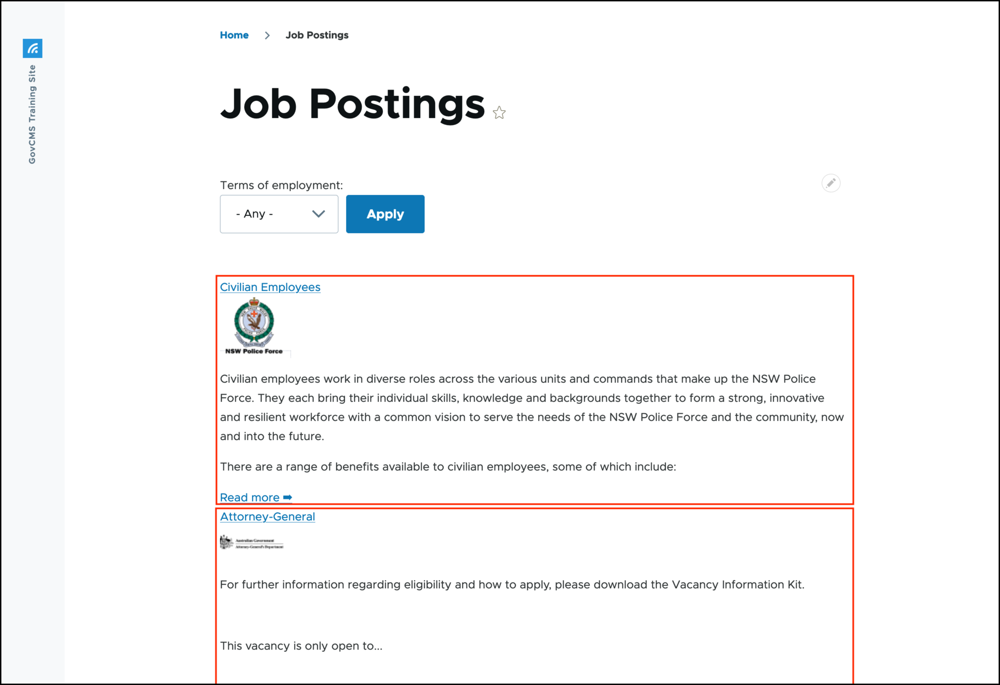 

1. Return to the View editing interface. You may return to the Jobs page and use the _Contextual links_, or navigate to View editing via _Structure_ → _Views_ → **Job Postings**.
2. Under _Fields_, click the **Content: Title**, expand the Style settings section and **Customize field and label wrapper HTML** to use H2 as the **Wrapper HTML element**.

    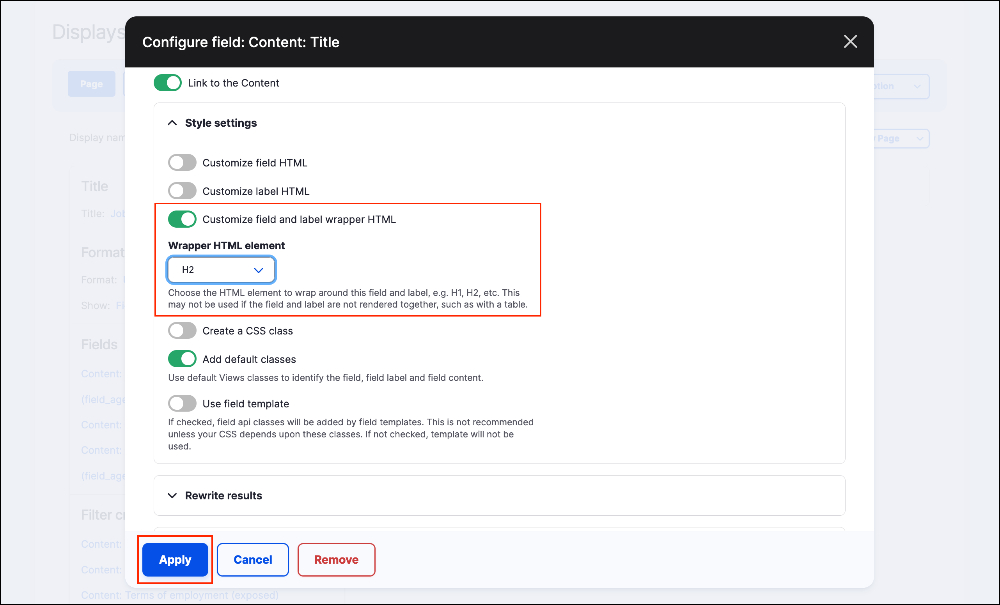
    
3. **Save** the view
4. Review the changes:

