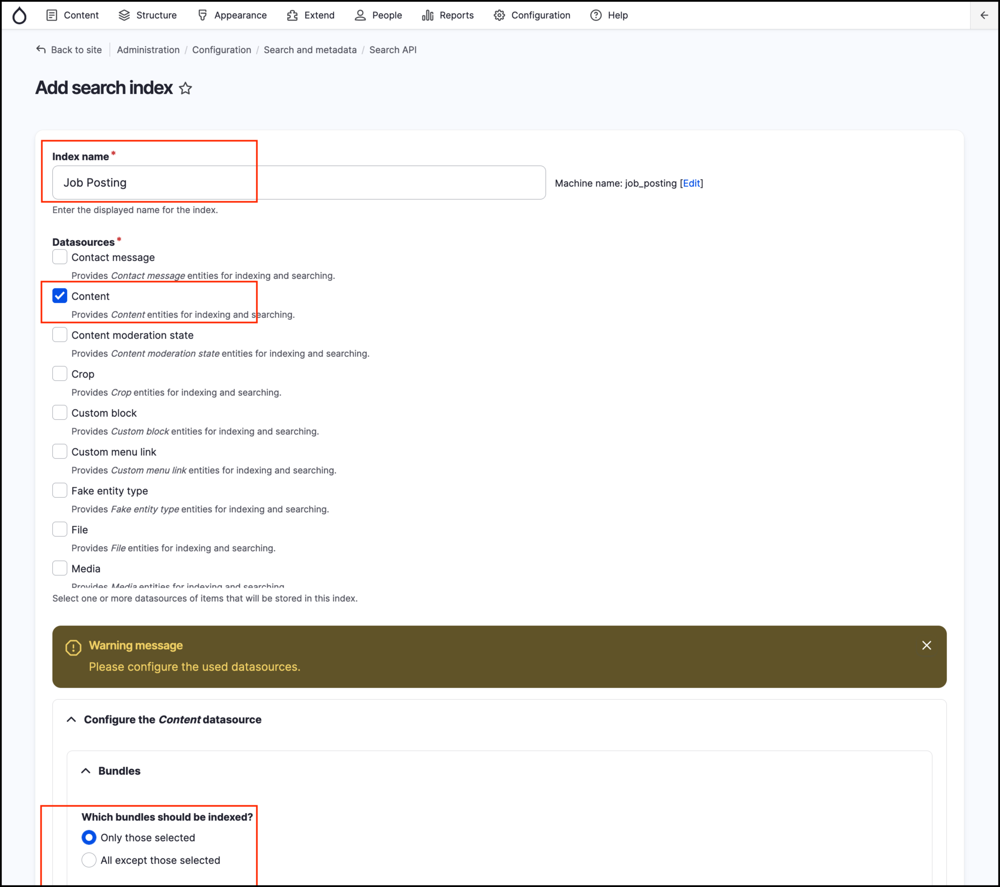
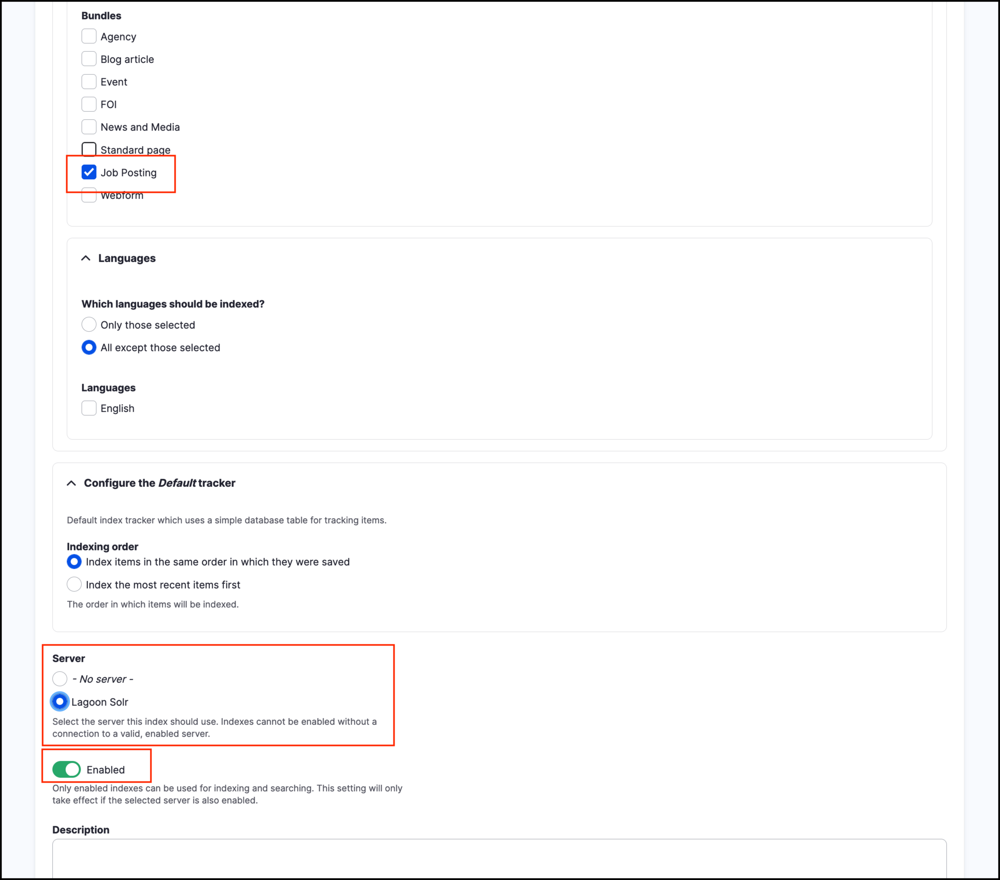

# Exercise 9.3: Create new search page with Search API

In GovCMS we can setup and configure multiple searches, this includes setting up multiple Search Indices and configuring them individually (if required).

## Enable Lagoon Search module

1. Navigate to the **Extend** page and locate **Lagoon search** module. Install it if not already installed.
2. Explore Solr search server.
3. If you enabled the **Lagoon search** module, the **Search API** page now shows the **Lagoon Solr** server, which did not exist before. This server was configured and enabled by the Lagoon Solr module.
4. In the next step we will attach an index to use it.

## Create new Search Index

To use the _Search API_ and to create a new search page, first, we have to create a search index. This index will ensure communications between the content of your website and end user.

1. Go to _Configuration_ → _Search and metadata_ → **Search API** and click the **Add Index** button.
2. **Index name**: Job Posting
3. **Data sources:** Content
4. **Which bundles should be indexed?:** Only those selected
5. **Bundles**: Job Posting
6. **Server**: Lagoon Solr
7. **Enabled:** Yes
8. Accept the remaining default settings and click the **Save** button.

