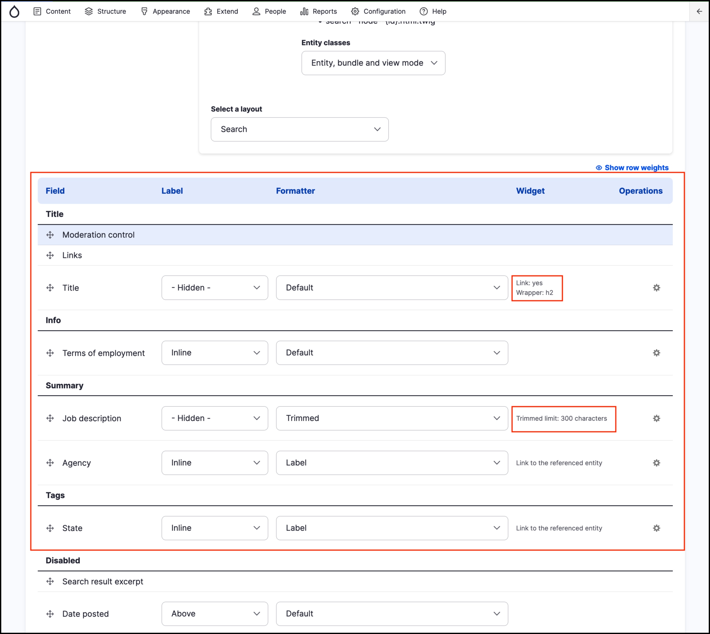
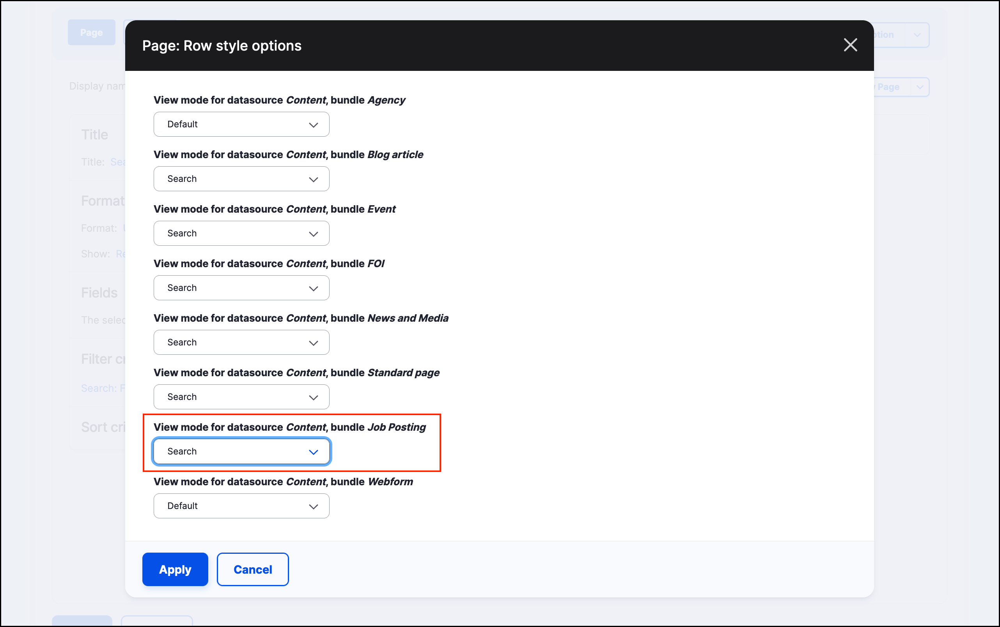

# Exercise 9.2: Set up Job posting content type display in global search

Try to conduct a search for a published Job posting content type. You’ll notice that it appears differently to other content types:

<table>
  <thead>
    <tr>
      <th style="text-align:left">
        

          
        

        
Standard page search results

      </th>
      <th style="text-align:left">
        

          
        

        
Not configured Job posting search result

      </th>
    </tr>
  </thead>
  <tbody></tbody>
</table>

This is because the search index isn’t configured to display the right View mode for the Job posting content type and it shows the same content as the full-page view.

Let’s change that, by activating Search view mode in the Job Posting content type and then configuring the search to use it.

1. Go to _Structure_ → _Content types_ → _Job Posting_ → **Manage display**.
2. Under the _Custom display settings_, enable the **Search** view mode. Save the changes.
3. Click the Search link at the top \(in the secondary tabs\) to navigate to the Search view mode.
4. Under the **Select a layout** field, select **Search** and save the changes. You’ll notice that the fields table below now shows multiple regions, such as:
   - Title
   - Info
   - Summary
   - Tags
   - Disabled
   
5. Rearrange fields \(drag-and-drop\) to match the screenshot. Move the remaining fields into the disabled region. Focus on making the Title field a link and trimming the Job description down to 300 characters. Remember to **Save** your changes.

    
    
    Now, as we created and customised the Job posting view mode for Search, let’s make the search page to use it. Our search page is made as a View, although it’s set to use the Search API functionality. We’ll explore how to create a Search API view later. 
    
7. Go to _Structure_ → _Views_ and edit the **Search** view.     
8. Under **Format** → **Show**, click on the **Settings** link: 

    
    
9. Locate the “**View mode for datasource** _**Content**_**, bundle** _**Job Posting”**_ and change it to use the **Search** view mode created earlier 

    
    
9. **Apply** your changes and **Save** the view.
10. Repeat search for a job posting and confirm if the display looks similar to other content types.

    <table>
  <thead>
    <tr>
      <th style="text-align:left">
        

          
        

        
Search result for Job posting

      </th>
      <th style="text-align:left">
        

          
        

        
Search result for News page

      </th>
    </tr>
  </thead>
  <tbody></tbody>
</table>

11. You may return to the Search view mode in the Job posting content type and change it further, to test how your changes affect the search results display widget.

