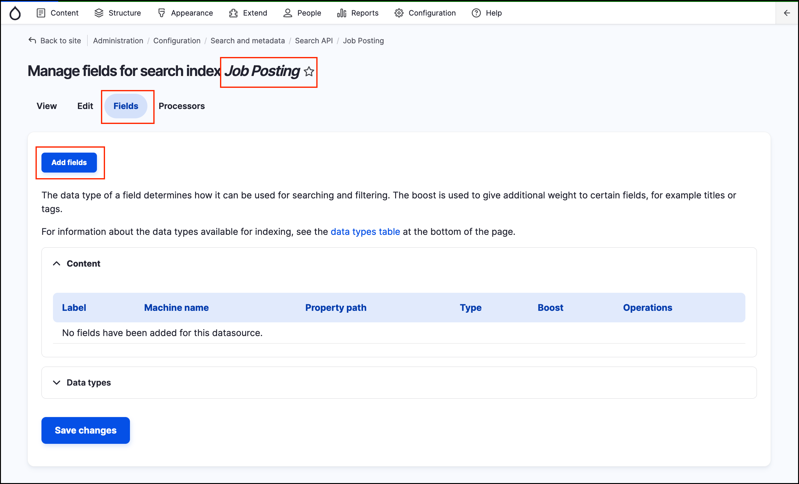
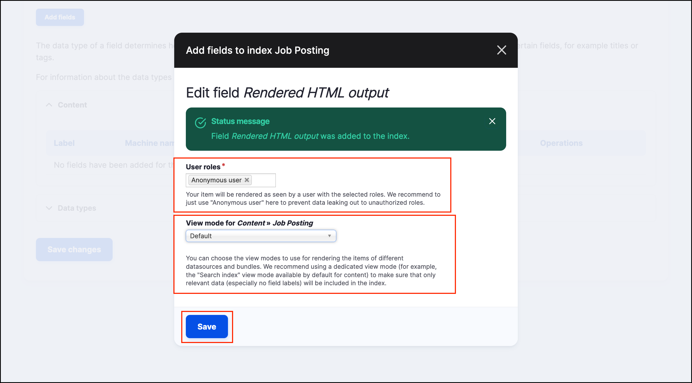
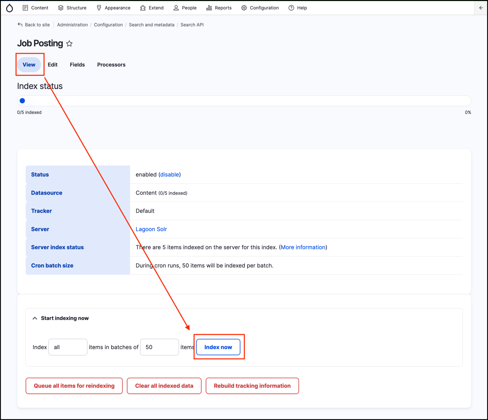
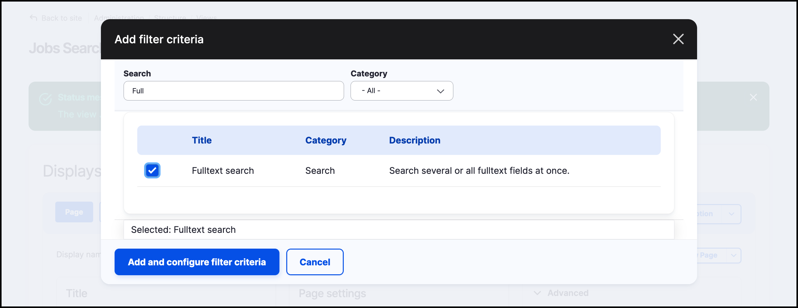
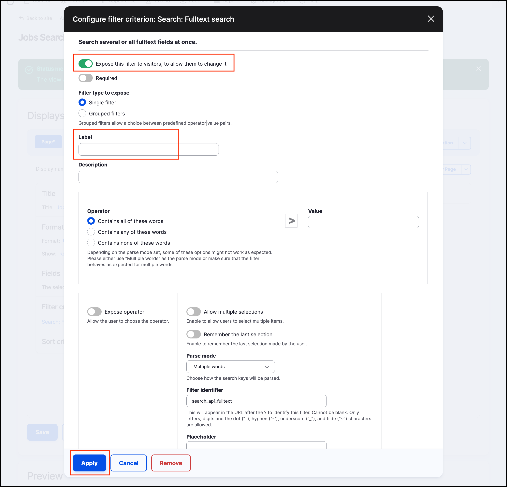

# Exercise 9.4: Add fields to the index

Before we can begin using our index, we have to add fields from the Job Posting index. To create the search page, we need to be able to use some fields, such as Content Type, and node status \(whether this is a published node\). To enable Facets, we need to add State/Territory, Agency and Terms of employment.

In addition, we need to add a fully rendered entity, as it is seen by Anonymous users, so that our index can display search results ordered by relevance.

## Add fields

From the **Fields tab** of the **Job Posting search index**, locate and add the following fields:

 1. Authored on \(created\)
 2. Agency \(field\_agencyref\)
 3. Content type \(type\)
 4. State \(field\_state\)
 5. Job description \(body\)
 6. Published \(status\)
 7. Terms of employment \(field\_jobterms\)
 8. Title \(title\)
 9. Rendered HTML output \(rendered\_item\)

When you select Rendered HTML output you will receive a prompt. Make sure the **Default** is selected as the **View mode for** _**Content**_ **»** _**Job Posting**_ field. 
 

Click **Done** and then **Save changes**.

## Index all content

Before we can use search, all Job Posting content on the site needs to be reindexed.

1. Click the View tab at the top 

    
    
2. Click the **Index now** button and wait for the batch process to complete.

> Note. You will see that the index will be created during cron runs - _During cron runs, 50 items will be indexed per batch._.

## Create Search API View Job Posting Search

Let’s utilise the newly created Search Index and create a View that would use the index as the datasource. Unlike the previous experiences of filtering and ordering the results using Views, we’ll now be using Search API.

1. Go to _Structure_ → _Views_, click **Add view** button.
   - **View name:** Jobs Search
   - **Description:** Jobs search using Search API
   - **Show:** Index Job Posting
  
2. **Create a page**.
3. **Page Title:** Jobs Search
4. **Page display settings: Display format:** _Unformatted list_ **of:** _Fields_.
3. Create a **menu link** in the **Main navigation** menu.
4. **Save and edit**.

## Configure Job Posting Search results to look like the General site search

1. Clear site cache.
2. Under **Format** - click **Fields**.
3. Select **Rendered entity**.
4. **Apply** the settings.
3. Select **Search** view mode, 
4. Apply the settings.
4. **Save** the view.

## Test Job Posting Search

1. Go to the frontend of the site and find the menu link **Jobs Search**.
2. Review the Jobs search result. What’s missing?

## Add search field

1. Return to the **View edit** interface.    
2. Under **Filter Criteria**, click **Add**.
3. Search for **“Fulltext search”** from the Search category. 

    
    
4. Click **Add and configure the filter.**
4. Toggle on - **Expose this filter to visitors, to allow them to change it**.
5. **Label:** empty

    
    
6. **Apply** the changes and **Save** the view.
7. Test it out.

## Add relevance sorting

1. Return to the **View editing interface**.
2. Add **Sort criteria** → **Relevance**.
3. Test it out.

